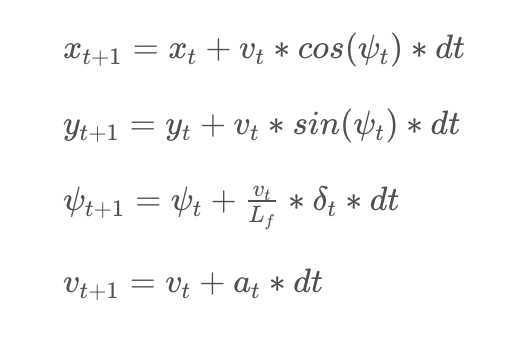

## Refections
The requirement of the project is to drive the car at a maximum reference speed around the track with no tire leaving the drivable portion of the track surface.
### Model
The model used was Kinematic model which is simplification of dynamic models that ignore tire forces, gravity and mass.  The state of the car is determined by following variables:
1. x position
2. y position
3. cross track error (cte)
4. velocity (v)
5. orientation (psi)
6. orientation error (espi)

#### Actuators:
1. steering angle (delta)
2. acceleration (throttle)

Using the following equation we can predict the state at t + 1 :

### Parameters Tuning

The most important parameters are N (number of time steps) and dt (frequency).  The high value of N increases the computation time because we are going to predict in each step. I initially tried a N = 25 , which was too much for my laptop. After some trial and error zeroed on N =10.
The time step chosen should be equal or more than the latency. I chose 0.1 which is also the latency.

### Latency:
In a real car, an actuation command won't execute instantly - there will be a delay as the command propagates through the system. In the simulator we are simulating a 100 ms delay. PID controller calculates error w.r.t present state and doesn't adapt to latency. But MPC can deal with latency more effectively.

Following are the equations used to predict  state by considering the latency.

// Predict ahead considering the latency

px = px + v * cos(psi) * latency;

py = py + v * sin(psi) * latency;

psi = psi - v * steer_value / Lf  * latency;

v = v + throttle_value * latency;

The car runs smoothly in the track with max reference speed of 80mph.
